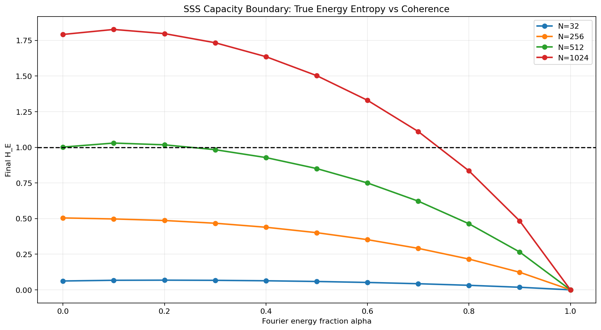
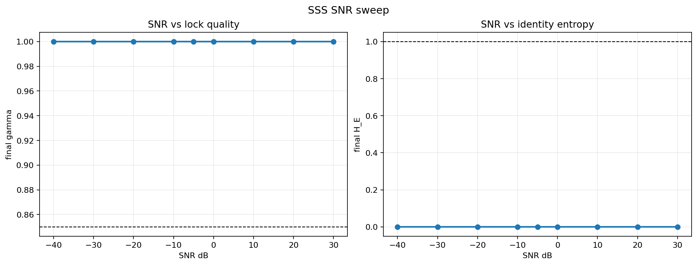
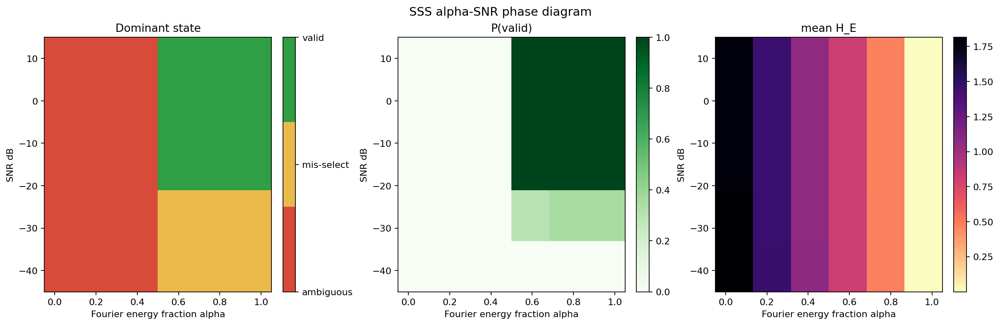

# SSS Phase Diagram Specification

This document freezes the minimal, falsifiable model for the Spectral Storage
System (SSS) validation probe. It intentionally avoids physical implementation
claims. The goal is to define the operating envelope that the simulator can
measure and future implementations can falsify.

## 1. System Definition

SSS maps structural and statistical constraints to two independent validity
signals:

```text
SSS = (alpha, rho = N / D, SNR) -> (separation, selection)
```

Where:

- `alpha` is the Fourier energy fraction in the hybrid codebook.
- `N` is the number of stored identities.
- `D` is the number of spectral bands.
- `rho = N / D` is identity density.
- `SNR` is vector-level signal-to-noise ratio in dB.

## 2. Metrics

> CRITICAL WARNING:
> `gamma` measures reachability only. It can approach `1.0` for valid memories,
> ambiguous memories, and confidently mis-selected memories. Never use `gamma`
> alone as a memory-integrity or identity-validity metric.

`gamma` answers: did the field converge to some attractor basin?

`H_E` measures separation.

It is entropy over squared correlations:

```text
p_i = gamma_i^2 / sum(gamma_j^2)
H_E = -sum(p_i * log(p_i))
```

`log` is the natural logarithm, so `H_E` is measured in nats. Thresholds such
as `H_crit = 1.0` depend on this normalization.

This is the true energy-entropy scorer. Entropy over raw correlation amplitudes
is reported separately as `H_amp` only for compatibility with earlier prototype
runs.

`correctness` measures selection.

It answers: did the recovered basin match the target identity?

```text
predicted_id = argmax_i(gamma_i)
correctness = predicted_id == target_id
```

## 3. Decision Rule

The operational threshold used in the current validation runs is:

```text
H_crit = 1.0
```

A value near `O(1)` should be understood as the point where the identity
distribution ceases to be sharply peaked under the current entropy
normalization. `1.0` is the current experimental value, not a universal
physical constant.

A spectral memory is valid only when both conditions hold:

```text
is_separable = H_E <= H_crit
is_correct = predicted_id == target_id
valid = is_separable and is_correct
```

Convergence alone is not sufficient.

## 4. Failure Modes

Structural failure: separation failure.

- Condition: `H_E > H_crit`
- Signature: `gamma ~= 1.0`, but identity entropy remains high.
- Cause: codebook coherence is insufficient relative to density.
- Control variables: `alpha`, `N / D`.

Dynamic failure: selection failure.

- Condition: `predicted_id != target_id`
- Signature: `gamma ~= 1.0`, `H_E <= H_crit`, but the wrong basin is selected.
- Cause: SNR is too low for reliable basin selection.
- Control variable: `SNR`.

## 5. Reproducible Setup

Current validation script:

```text
VALIDATION/spectral_tensor_emulator.py
```

Baseline parameters used for the current plots:

```text
D = 4096
N in {32, 256, 512, 1024}
alpha in [0.0, 1.0]
SNR uses controlled vector-level noise
H_crit = 1.0
recovery mode = competitive elastic echo
```

Representative commands:

```powershell
python VALIDATION/spectral_tensor_emulator.py --sweep-capacity --sweep-alphas 0.0,0.1,0.2,0.3,0.4,0.5,0.6,0.7,0.8,0.9,1.0 --sweep-ns 32,256,512,1024
python VALIDATION/spectral_tensor_emulator.py --sweep-snr --num-id 1024 --target-idx 7 --codebook fourier
python VALIDATION/spectral_tensor_emulator.py --phase-diagram --num-id 1024 --target-idx 7 --sweep-alphas 0.0,0.5,0.7,0.8,0.9,1.0 --sweep-snrs 10,-10,-20,-30,-40 --trials 20
```

Confirmed statistical run (trials=20):

```powershell
python VALIDATION/spectral_tensor_emulator.py --phase-diagram --num-id 1024 --target-idx 7 --sweep-alphas 0.0,0.5,0.7,0.8,0.9,1.0 --sweep-snrs 10,-10,-20,-30,-40 --trials 20
```

This run is complete. Results are in Section 6 and `VALIDATION/STATUS.md`.

## 6. Current Results

Capacity boundary at `D=4096`, `SNR=-5 dB`, true `H_E`:

```text
N=32:   sampled alpha_crit <= 0.00
N=256:  sampled alpha_crit <= 0.00
N=512:  sampled alpha_crit <= 0.30
N=1024: sampled alpha_crit <= 0.80
```

SNR sweep for `N=1024`, pure Fourier codebook:

```text
SNR 30 dB through -20 dB: correct lock, H_E = 0.000
SNR -30 dB and below: wrong identity lock, H_E = 0.000
```

Statistically validated alpha-SNR phase diagram for `N=1024`, `D=4096`, `trials=20`:

```text
low alpha: ambiguous/inseparable
high alpha + adequate SNR: valid memory
high alpha + very low SNR: clean but wrong-basin lock
```

## 7. Plots

Capacity boundary:



SNR sweep:



Pilot alpha-SNR phase diagram:



## 8. Observed Laws

L1: `gamma` is a reachability invariant in the tested regimes.

It tends to `1.0` for valid memories, ambiguous memories, and wrong-basin locks.
Therefore `gamma` must not be used as the sole validation metric.

L2: `H_E` depends primarily on codebook coherence and density.

Low `alpha` can create a structural entropy floor even when `gamma = 1.0`.

L3: correctness depends primarily on SNR.

At sufficiently low SNR, the system can select the wrong basin with low `H_E`.
This is a confident error, not an ambiguity failure.

L4: low `alpha` cannot be compensated by SNR.

Increasing signal clarity does not fix structurally merged basins.

## 8.1 Empirical Boundary Summary (trials=20)

For D=4096, N=1024:

Structural boundary:
- α transitions between 0.70 → 0.80
- H_E drops from ~1.077 → ~0.813
- separability flips from 0.00 → 1.00

Dynamic boundary:
- SNR transitions between -20 dB → -30 dB
- correctness drops from 1.00 → ~0.30–0.35

These boundaries are stable across trials and represent the current
validated operating envelope of the model.

## 9. Limits

This is an ideal mathematical validation model.

Known limits:

- Assumes idealized complex vectors and phase-preserving updates.
- Fourier codebooks represent an upper bound on orthogonality.
- Does not model physical leakage, attenuation, thermal noise, nonlinear coupling,
  fabrication tolerances, or read/write hardware constraints.
- The phase diagram is statistically validated at `trials=20` with stable
  classification boundaries and consistent entropy values across runs.
  Further refinement (denser α sampling, higher trials) may improve boundary
  resolution but does not change the observed regime structure.
- The current simulator validates the abstract SSS law, not a deployable storage
  device.

## 10. Final Statement

A spectral memory is valid only when identities are both separable and correctly
selected; convergence alone is not sufficient.

Separation defines possibility. Selection defines reality.
